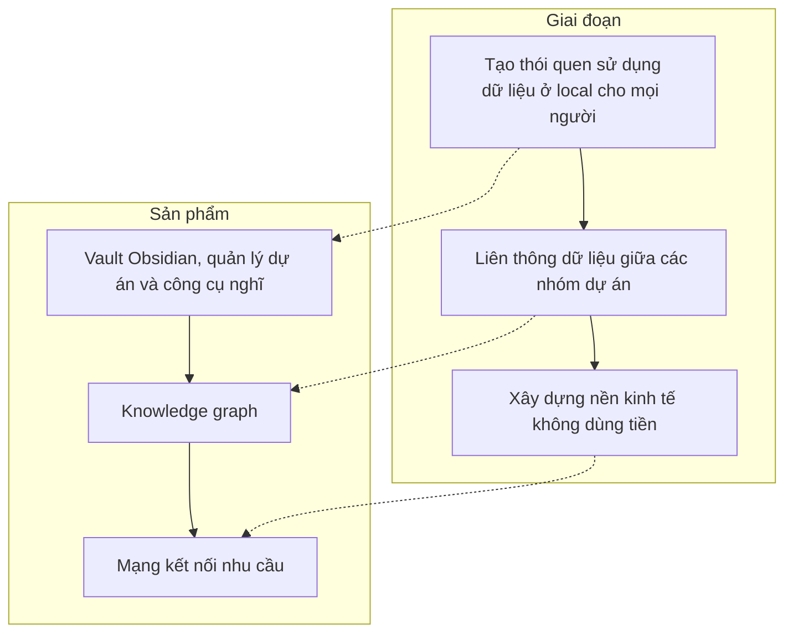

English below
# Vấn đề: Sự hợp tác giữa các nhóm dự án chưa đạt được hiệu quả tối ưu
Việc tìm kiếm người hợp tác cho các dự án mới có ý tưởng đột phá có vẻ khó. Trong 5 năm mình tham gia vào các mạng lưới, cộng đồng phi lợi nhuận, mình cảm thấy mặc dù đã có rất rất nhiều tổ chức muốn thúc đẩy một hệ sinh thái giữa các dự án, nhưng lại chưa cảm thấy sự hiệu quả đạt đến mức tối ưu, mặc dù mình đánh giá rất cao nỗ lực và sự chuyên nghiệp của họ. Mình phải thẳng thắn nói rằng mình thất vọng rất nhiều sau các sự kiện kết nối. Mọi người có biết đến nhau, nhưng sau buổi hôm đó cũng chỉ dừng lại ở đó, không đi xa hơn được. Mình nghĩ rằng nguyên nhân quan trọng nhất là các bên **quá nhiều việc**. Mọi người không thể đi đủ sâu để tìm hiểu về nhau. Vì để có thể đi sâu thì phải tốn rất rất nhiều thời gian, mà thường tổ chức phải phát triển đủ lớn để có một người chuyên về việc kết nối, chứ công việc thì rất rất nhiều. Nếu như các tổ chức kết nối cộng đồng chủ động phân loại và tổ chức các buổi gặp gỡ cho các dự án quy mô nhỏ tương tự nhau thì rất tốt, nhưng mình không thấy được điều đó.

[[../../⚡Hiểu biết sâu/Quản lý dự án, phát triển sản phẩm, xây dựng tổ chức/Hệ sinh thái/Để một hệ sinh thái hoạt động thực sự hiệu quả thì lượng năng lượng dành ra để nắm bắt tín hiệu của môi trường phải giảm tới mức gần như bằng 0|Để một hệ sinh thái hoạt động thực sự hiệu quả thì lượng năng lượng dành ra để nắm bắt tín hiệu của môi trường phải giảm tới mức gần như bằng 0]]. Bạn không cần phải hỏi mà vẫn biết nhu cầu của những thành viên xung quanh, và họ không cần phải hỏi cũng biết bạn đang cần gì. Mặc dù chúng ta luôn khuyến khích đặt câu hỏi, nhưng [[../../⚡Hiểu biết sâu/Quản lý dự án, phát triển sản phẩm, xây dựng tổ chức/Hệ sinh thái/Một hệ sinh thái không hoạt động bằng cách đặt câu hỏi, mà bằng cách không cần hỏi cũng biết câu trả lời là gì|Một hệ sinh thái không hoạt động bằng cách đặt câu hỏi, mà bằng cách không cần hỏi cũng biết câu trả lời là gì]]. Và các công cụ quản lý dự án hiện nay không có chức năng cung cấp thông tin của nhóm cho những nhóm khác. Chỉ khi nào nhu cầu của các bên liên quan hiện ra ngay trong kho dữ liệu của nhóm mà không cần phải hỏi họ hay thậm chí là nhập liệu, thì lúc đó chúng ta mới có thể bắt đầu nói về một hệ sinh thái mà những thành viên mới – vốn rất thiếu nhân lực – vẫn có thể hưởng lợi.

# Sứ mạng: Tạo thói quen sử dụng dữ liệu ở local cho mọi người
Trong những phần mềm quản lý công việc trên thị trường hiện nay, mình thấy có duy nhất Obsidian (và Git) là có thể đáp ứng nhu cầu đó. Triết lý của Obsidian là:

- [[../../⚔️ Lớp Obsidian và Git/💎 Giới thiệu về Obsidian/Mô tả về Obsidian/Obsidian lưu dữ liệu nằm trên máy của người dùng|Dữ liệu nằm trên máy của người dùng và ở định dạng đơn giản]]
- [[../../⚔️ Lớp Obsidian và Git/💎 Giới thiệu về Obsidian/Mô tả về Obsidian/Điểm mạnh của Obsidian/Obsidian xem liên kết là công dân hạng nhất|Liên kết là công dân hạng nhất]]
- [[../../⚔️ Lớp Obsidian và Git/💎 Giới thiệu về Obsidian/Mô tả về Obsidian/Điểm mạnh của Obsidian/Obsidian cực kỳ dễ mở rộng tính năng|Cực kỳ dễ mở rộng tính năng]]

Các triết lý này mở ra một loạt những tính năng một dự án phát triển cộng đồng muốn có. Ví dụ như:
- Thành viên cộng đồng có thể đóng góp những **hiểu biết sâu sắc, nhu cầu và các dữ liệu khác một cách thụ động** vào kho dữ liệu chung. Họ không cần quan tâm (quá nhiều) vào kho dữ liệu chung mà vẫn có thể làm nó phong phú hơn, chỉ bằng việc tập trung vào việc tự quản lý dự án của mình. Sự đóng góp của họ chỉ là sản phẩm phụ của việc họ tập trung vào mình.
- [[../../⚔️ Lớp Obsidian và Git/💎 Giới thiệu về Obsidian/Mô tả về Obsidian/Điểm mạnh của Obsidian/Đồ thị giúp thấy được bức tranh tổng thể|Đồ thị giúp thấy được bức tranh tổng thể]]: điều gì nhiều người quan tâm nhất? Ai có cùng nhu cầu với ai? Để ý rằng [[../../⚡Hiểu biết sâu/Nghĩ về việc nghĩ/Sự chuyên gia (expertise) đến từ việc nhìn ra mẫu hình|Sự chuyên gia (expertise) đến từ việc nhìn ra mẫu hình]], [[../../⚡Hiểu biết sâu/Nghĩ về việc nghĩ/Khoa học nhận thức/Trực giác là việc nhìn ra mẫu hình không hơn không kém|Trực giác là việc nhìn ra mẫu hình không hơn không kém]], và [[../../⚡Hiểu biết sâu/Nghĩ về việc nghĩ/Môi trường nghĩ, nhận thức tăng cường/Đồ thị giúp ta thấy được mẫu hình|Đồ thị giúp ta thấy được mẫu hình]]
- [[../../⚔️ Lớp Obsidian và Git/💎 Giới thiệu về Obsidian/Mô tả về Obsidian/Điểm mạnh của Obsidian/Obsidian miễn phí, không có chức năng nào phải trả tiền hay tính theo đầu người|Hoàn toàn miễn phí, không có chức năng nào phải trả tiền hay tính theo đầu người]]. [[../../⚔️ Lớp Obsidian và Git/💎 Giới thiệu về Obsidian/Mô tả về Obsidian/Điểm mạnh của Obsidian/Obsidian phù hợp cho các dự án nhỏ, không có nhiều tiền|Phù hợp khi bạn cần những chức năng nâng cao hoặc khi đội ngũ mở rộng mà không có nhiều tiền]]
- [[../../⚔️ Lớp Obsidian và Git/💎 Giới thiệu về Obsidian/Mô tả về Obsidian/Điểm mạnh của Obsidian/Obsidian cực kỳ dễ mở rộng tính năng|Với plugin]], tính năng của nó có thể mở rộng theo nhu cầu và mức độ thành thạo của người dùng, khiến cho nó trở thành một [[../../⚡Hiểu biết sâu/Nghĩ về việc nghĩ/Môi trường nghĩ, nhận thức tăng cường/Đọc và viết/Ghi chú thông tin/Giàn giáo nhận thức cần phải tuỳ biến với quá trình hiểu biết của người dùng|giàn giáo nhận thức giúp giảm sự quá tải của bạn]], khiến cho nó trở thành một môi trường tư duy để tăng cường nhận thức (augmenting cognition)
- [[../../⚔️ Lớp Obsidian và Git/💎 Giới thiệu về Obsidian/Mô tả về Obsidian/Điểm mạnh của Obsidian/Có thể dùng kết hợp Obsidian với các giải pháp xử lý dữ liệu khác|Có thể dùng kết hợp Obsidian với các giải pháp xử lý dữ liệu khác]], tránh tình trạng [[../../⚡Hiểu biết sâu/Khoa học máy tính/Cơ sở dữ liệu/Việc lưu dữ liệu ở các công cụ khác nhau tạo thành các đảo thông tin|phân mảnh dữ liệu do lưu dữ liệu ở nhiều công cụ khác nhau]]

Năm 2015, để giải quyết những thách thức phát triển lớn mà thế giới phải đối mặt, Liên Hợp Quốc đã đề ra **17 Mục tiêu Phát triển Bền vững (SDG)**. Đó là động lực để các quốc gia hướng tới:

<iframe width="560" height="315" src="https://www.youtube.com/embed/M-iJM02m_Hg" title="YouTube video player" frameborder="0" allow="accelerometer; autoplay; clipboard-write; encrypted-media; gyroscope; picture-in-picture; web-share" allowfullscreen></iframe>

Mục tiêu cuối cùng trong 17 mục tiêu đó chính là về thúc đẩy sự hợp tác. Ở Việt Nam, mục tiêu số 17 này được chia thành [17 mục tiêu nhỏ hơn](https://data.vietnam.opendevelopmentmekong.net/vi/dataset/bao-cao-t-ng-h-p). Ta hãy xem một mục tiêu trong số chúng:

> **Mục tiêu 17.4:** Tăng cường quan hệ đối tác toàn cầu cho phát triển bền vững, kết hợp với quan hệ đối tác nhiều bên nhằm huy động và chia sẻ kiến thức, kinh nghiệm, công nghệ và tài chính để hỗ trợ đạt được các mục tiêu phát triển bền vững ở Việt Nam
>
> 

Việc phổ cập những công cụ như thế này sẽ giúp đáp ứng mục tiêu 17.4 này.

Xem thêm:: [Các nguồn tiền của LHQ cho những mục tiêu này đã được rót về Việt Nam như thế nào?](https://vietnam.un.org/vi/sdgs/17 "")
# Tầm nhìn: Xây dựng nền kinh tế không dùng tiền
Nếu mô hình này thành công, thì ta sẽ xây dựng một mạng kết nối nhu cầu, nơi mà mọi người đáp ứng nhu cầu lẫn nhau. Họ có thể làm được như vậy vì tất cả mọi thành viên đều biết nhu cầu nào đang có nhiều người có nhất, ai đang có cùng nhu cầu với ai, v.v. Các nhu cầu của họ sẽ được thoả mãn bằng việc trao đổi nhu cầu cho nhau, hoặc cùng hợp tác để tạo giải pháp chung. Khi mạng lưới này lớn hơn nữa, thì nó sẽ hoạt động như một nền kinh tế. Bởi vì các nhu cầu trong đây được đáp ứng mà không cần dùng đến tiền làm trung gian, nên nó là một nền kinh tế không dùng tiền. Nó sẽ là sự kết hợp giữa nền kinh tế nền tảng (platform economy) và nền kinh tế quà tặng (gift economy). Nó cũng có liên hệ rất mật thiết tới [[../../⚡Hiểu biết sâu/Kinh tế học và chủ nghĩa tân tự do. Tâm lý học quản lý và lao động/Kinh tế học, chủ nghĩa tân tự do/Các loại hình kinh tế mới/Nền kinh tế chăm sóc/Nền kinh tế chăm sóc|Nền kinh tế chăm sóc]] (care economy).

Ý tưởng [nền kinh tế không dùng tiền](https://en.wikipedia.org/wiki/Non-monetary_economy "Non-monetary economy - Wikipedia") không phải là một khái niệm mới. Một ví dụ điển hình là [Hệ thống Trao đổi Cộng đồng (Community Exchange System)](https://www.community-exchange.org/home/ "Community Exchange System | Your Talents are Your Wealth") với hơn 1200 nhóm trao đổi ở 107 nước. Tuy nhiên chưa có ở Việt Nam. 

> [!info] Bài chi tiết: [Một đám mây chim sáo](https://quảcầu.cc/mot-dam-may-chim-sao/?utm_source=CV+%C2%BB+T%E1%BB%AB+vi%E1%BB%87c+l%C6%B0u+d%E1%BB%AF+li%E1%BB%87u+t%E1%BA%A1i+ch%E1%BB%97+%C4%91%E1%BA%BFn+s%E1%BB%B1+h%E1%BB%A3p+t%C3%A1c+%C4%91a+ph%C6%B0%C6%A1ng+v%C3%A0+li%C3%AAn+ng%C3%A0nh+v%C3%A0+n%E1%BB%81n+kinh+t%E1%BA%BF+kh%C3%B4ng+d%C3%B9ng+ti%E1%BB%81n&utm_medium=M%E1%BB%99t+%C4%91%C3%A1m+m%C3%A2y+chim+s%C3%A1o&utm_campaign=Giai+%C4%91o%E1%BA%A1n+2)

Vấn đề hiện tại bây giờ chỉ là: có bao nhiêu nhóm dự án sẵn sàng muốn sử dụng Obsidian cho việc quản lý dự án của mình?

# Tóm lại

Xem kế hoạch chi tiết ở [[../📐 Dự án|📐 Dự án]]
# Phụ lục: Thách thức: [[../../⚡Hiểu biết sâu/Khoa học máy tính/Đánh đổi/Có sự đánh đổi giữa sự tự do sử dụng dữ liệu và sự tiện lợi trong việc hợp tác|Có sự đánh đổi giữa sự tự do sử dụng dữ liệu và sự tiện lợi trong việc hợp tác]]
Trong ngành khoa học máy tính, [[../../⚡Hiểu biết sâu/Khoa học máy tính/Hợp tác làm việc/Việc hợp tác làm việc thời gian thực với dữ liệu được lưu ở local là một bài toán khó|Việc hợp tác làm việc thời gian thực với dữ liệu được lưu ở local là một bài toán khó]]. Điều đó khiến cho [[../../⚡Hiểu biết sâu/Khoa học máy tính/Đánh đổi/Có sự đánh đổi giữa sự tự do sử dụng dữ liệu và sự tiện lợi trong việc hợp tác|chúng ta phải đánh đổi giữa sự tự do sử dụng dữ liệu và sự tiện lợi trong việc hợp tác]]. [[../../⚡Hiểu biết sâu/Khoa học máy tính/Hợp tác làm việc/Việc trung tâm hoá việc lưu trữ dữ liệu trên máy chủ sẽ lấy đi autonomy và agency của người dùng cuối|Việc trung tâm hoá việc lưu trữ dữ liệu trên máy chủ sẽ lấy đi autonomy và agency của người dùng cuối]]. Xu thế hiện nay là [[../../⚡Hiểu biết sâu/Khoa học máy tính/Hợp tác làm việc/Các nhóm làm việc qua mạng ngày càng nhiều|Các nhóm làm việc qua mạng ngày càng nhiều]], đến nỗi khi được hỏi về app đa số mọi người sẽ chỉ nhắc đến những cloud app như Google Drive hay Notion. Nghĩa là chúng ta đã hy sinh quá nhiều sự tự chủ dữ liệu cho sự tiện lợi đến nỗi chúng ta không còn biết gì về một loạt các phần mềm khác mạnh mẽ hơn. Việc đánh mất sự tự chủ đó là lý do khiến cho chúng ta luôn cảm thấy mình mù công nghệ, và chấp nhận rằng mình sẽ chẳng hiểu gì về công nghệ cả. Đây chính là một sự bất lực học được. [[../../⚡Hiểu biết sâu/Khoa học máy tính/Lập trình/Người không học về lập trình thấy việc lập trình như làm phép thuật|Người không học về lập trình thấy việc lập trình như làm phép thuật]], trong khi [[../../⚡Hiểu biết sâu/Khoa học máy tính/Lập trình/Lập trình viên biết lập trình chủ yếu là nhờ biết google|Lập trình viên biết lập trình chủ yếu là nhờ biết google]]. Bạn cũng biết google vậy, vậy tại sao vẫn thấy nó giống như làm phép thuật? Chúng tôi nghĩ một phần lớn là vì đã từ lâu bạn không còn cảm giác mình có sự tự chủ với dữ liệu của mình rồi. Khi bạn đã có lại được cảm giác đó, bạn sẽ thấy mình tự tin hơn về công nghệ.

---
# English
## The problem
It’s hard for new-founded independent projects to find collaborators. Although there are many organizations that want to promote an ecosystem between projects, the optimal outcomes (not saying the expected ones) isn't achieved. Especially if the idea is so novel. Since it takes a lot of time and cognitive wordload to have deep conversations, often the project has to grow big enough to have a staff specialized in networking. 

Finding collaborators for new-founded independent projects with groundbreaking ideas is difficult. In the 5 years I've been involved in non-profit networks and communities, I feel that although there are many organizations that want to promote an ecosystem between projects, the optimal effectiveness has not achieved yet, despite of my great appreciation for their effort and professionalism. I must frankly say that I am very disappointed after the networking events. Everyone knew each other, but after the events, everything just stopped there, nothing could go any further. I think the most important reason is that the participants are too busy. People can't go deep enough to get to know each other. Especially if the idea is so novel. Since it takes a lot of time and cognitive wordload to have deep conversations, often the project has to grow big enough to have a staff specialized in networking. If there are community connecting organizations actively categorize and organize meetings for similar new-founded projects, that's great, but I don't see that.

For an ecosystem to operate effectively, the amount of energy spent to capture the signals of the environment must be reduced to almost zero. You do not need to ask and still know the needs of the stakeholders, and they don't have to ask to know what you need. While we always encourage asking questions, an ecosystem does not work by asking questions, but by knowing what the answers are without asking. And current project management tools do not have the ability of providing team information to other teams. Until stakeholders' needs are stored right in the team's database without having to look for it then we can begin to talk about an ecosystem where new organizations and projects – who are very short of staff – can still benefit.

In the current market of task management and note-taking software, Obsidian seems to be a promising tool that can meet the need of collaboration in large-scale. The power of them lies in Obsidian's philosophies:
- [Local-first ](https://www.inkandswitch.com/local-first/) and plain text
- Link as first-class citizen
- Make it super extensible

These philosophies enables a vast of functionalities that a community development project would need. To name a few:
- Community members can **passively contribute their insights, needs and other data** in a shared repository. They don't need to care (too much) about the shared database but can still enjoy the benefit from it, just by focusing on managing their own projects. Their contributions are just a by-product of their focus on themselves.
- Via graphs, everyone can see the **big picture of the community**: which need is needed most, who have the same needs with whom, etc
- **Completely free**, no paid functions or per capita. Suitable when you need advanced functions or when the team is expanding without much money
- With plugins, its functionalities can gradually expand depending on the needs and the current status of expertise of the users, making it a **cognitive scaffolding** to support part of the cognitive load, making it a medium of thought to augment our cognition
- Obsidian can be used in combination with other data processing solutions, avoiding data fragmentation due to storing data in many different tools.

So what will we do is essentially categorized as technology education: helping new-founded organizations to learn Obsidian.

## The plan
### Rough Financial Projection: How will our revenue, expenses, cash flow develop? How and when will we break even?
Currently, all of our income comes from donation. We expect it to grow more.

Let's talk about the evisioned ecosystem in the form of a shared database. One of its vital feature is a graph of needs of individuals and organizations. All participants knows which needs are needed most, who have the same needs with me, etc, and thus can figure out a way to satisfy their needs. Mostly via collaborating with others who have the same needs with them, or via exchanging the needs. If the network grows and operates as expected, after a tipping point, the percentage of satisfied needs of an entity will grow larger and larger. This makes the whole network functions as an economy. Since the needs are satisfied without money involves, so this is a **moneyless economy**.

[Non-monetary economy](https://en.wikipedia.org/wiki/Non-monetary_economy "Non-monetary economy - Wikipedia") is not a new concept. The oldest example of such an economy is barter. The gift economy is also another example. The [Community Exchange System](https://www.community-exchange.org/home/ "Community Exchange System | Your Talents are Your Wealth") is a success story that has 1241 exchange groups in 107 countries. It can also be analyzied as a platform economy. Our product would be similar to it.

So back to the question, it is possible to answer how will the our revenue, expenses, cash flow develop. But answering them should be considered as secondary. The better question should be: how the ecosystem serves the needs of its members, or at least the our members?

### Market
We are in the process of conducting market research so their is no solid evidence yet. All we have for now is our experience and some interviews. Plus that as we aim at joining the moneyless economy, many concepts from traditional economics many not be well applied or required to be modified. So currently we can't say much about the total available market or how the market may evolve in the future.

Our target beneficiaries is people who want to learn how to manage their life well, organizations who want to find a tool to manage their projects or build community efficiently, and anyone who want to join a moneyless economy where you list your needs and cooperate to anyone who are also interested in having those needs served.

So far, the only direct competitors we can see are **cloud solutions for business**, like Google Workplace or Microsoft 365. Their strengths: 
- Backed big companies: lots of money, lots of trust
- Users already know how to use the tools well

Our weaknesses:
- Coreteam cannot focus full-time on the project
- Obsidian and Git require users to spend a decent amout of effort to learn

## Appendix
It isn't news that by centralizing data storage on servers, users' ownership and agency on their own data is taken away. It also isn't news that storing data in local solve this problem. In fact, this is the most basic method in data storing and everyone knows it. However, if you ask an avarage user to list some data storing solutions, they would very likely only name cloud apps like Google Docs or Notion. There is a reason for that: centralizing data storage on servers is enable real-time collaboration excellently.

So there is a tradeoff that every system designer has to face: do you want your users to gain whole control on their own data, or do you want to enable real-time collaboration? This, by far, is still one of the hard problems in computer science.

However, digging deeper on the problem you will see that [[../../⚡Hiểu biết sâu/Khoa học máy tính/Hợp tác làm việc/Hợp tác thời gian thực không thực sự cần thiết trong đa số trường hợp. Đa số đều là hợp tác phi đồng bộ|Hợp tác thời gian thực không thực sự cần thiết trong đa số trường hợp. Đa số đều là hợp tác phi đồng bộ]]. And there is an excellent tool for asynchronous collaboration for local-first data: Git.

So what will we do is essentially categorized as technology education: helping new-founded organizations to learn Obsidian and Git.
